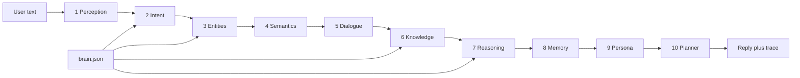

# Cortex overview

Cortex is a **browser-only conversational engine**. It is not a cloud language model. Replies are assembled in the page from a JSON “brain” (`data/brain.json`) plus a ten-phase JavaScript pipeline (`js/engine.js`). There is no backend request to an AI server.

The original one-file bot (`chatBot.html`) already stored regex → reply pairs as data. Cortex keeps that idea and scales it: intents, entities, a knowledge graph, dialogue, memory, and a live trace of every phase.

## What you get

- Chat in English and Finnish
- Local SVG drawings for **cat / dog / both** (no image CDN required)
- Facts and yes/no checks from a JSON knowledge graph
- Arithmetic, unit conversion, coin/dice, reverse/spell
- Browser memory (`localStorage`): name, favorites, taught “when I say… reply…” rules
- **Graph quiz** — `quiz me` / `quiz me about cats` asks questions generated from the graph (and extra JSON items). Score stays on this device
- Brain tab: edit, apply, export, import the JSON without a server

## Run

```bash
python3 -m http.server 8080
```

Open `http://localhost:8080/`. HTTP is only used to fetch static files (`index.html`, `data/brain.json`). Inference never leaves the machine.

```bash
node tests/engine.test.js
```

## Layout

| Path | Role |
| --- | --- |
| `index.html` | Shell: pipeline rail, chat, inspector |
| `css/app.css` | Layout and theme |
| `js/engine.js` | Ten-phase NLU + quiz + math |
| `js/app.js` | DOM: messages, chips, Brain editor |
| `data/brain.json` | Intents, lexicon, graph, copy, quiz extras |
| `chatBot.html` | Original regex JSON bot |
| `ROADMAP.md` | Ten implementation ideas (next builds) |
| `tests/engine.test.js` | Node checks, no browser required |



## Ten phases (shipped)

1. **Perception** — trim, contractions (`whats` → `what is`), tokens, EN/FI, n-grams, sentiment  
2. **Intent** — regex + keyword weights + example cosine  
3. **Entities** — gazetteers, names, math, conversions, graph node labels  
4. **Semantics** — character 3-gram vectors, local cosine (no remote embeddings)  
5. **Dialogue** — topic, missing slots, quiz turn-taking  
6. **Knowledge** — nodes, `is_a` edges, attributes (legs, toes)  
7. **Reasoning** — templates, math, conversions, quiz grading, sprites  
8. **Memory** — `localStorage` plus taught rules and quiz best score  
9. **Persona** — language, tone, light safety  
10. **Planner** — text, SVG, suggestion chips, explainable trace  

## Extend it (still no cloud)

1. Add an intent object to `data/brain.json` (`patterns`, `keywords`, `examples`, `handler`).  
2. If the handler is new, add a `case` in `js/engine.js`.  
3. Add a `check("your phrase", "intent_id", /expected/)` line in `tests/engine.test.js`.  
4. Reload the page (or paste JSON in the Brain tab and click Apply).

That is the whole “training” loop: **data in JSON, behavior in JS, proof in tests**.

## Quiz feature

Say `quiz me` or `quiz me about cats`. Cortex builds up to five questions from:

- `quiz[]` in `brain.json` (hand-authored)
- `is_a` edges (yes/no)
- numeric `attrs.legs` (how many legs)

Answers are graded locally (exact tokens, then n-gram overlap). `skip` / `stop quiz` work mid-round. Last and best scores appear on the Memory tab.
