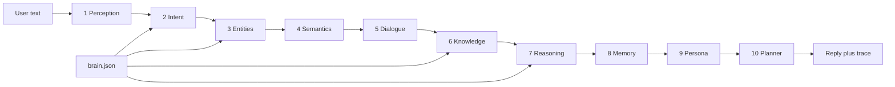

# Cortex overview

Cortex is a **browser-only conversational engine**. It is not a cloud language model. Replies are assembled in the page from a JSON “brain” (`data/brain.json`) plus a ten-phase JavaScript pipeline (`js/engine.js`). There is no backend request to an AI server.

The original one-file bot (`chatBot.html`) already stored regex → reply pairs as data. Cortex keeps that idea and scales it: intents, entities, a knowledge graph, dialogue, memory, and a live trace of every phase.

## What you get

- Chat in English and Finnish
- Local SVG drawings for **cat / dog / both** (no image CDN required)
- Facts and yes/no checks from a JSON knowledge graph
- Arithmetic, unit conversion, coin/dice, reverse/spell
- Browser memory (`localStorage`): name, favorites, taught “when I say… reply…” rules
- **Graph quiz** — `quiz me` / `quiz me about cats` asks questions generated from the graph (and extra JSON items). Score stays on this device
- **Skill packs** — enable `data/packs/cooking.json` in the Brain tab without replacing the core brain
- **Graph pane** — SVG of nodes and `is_a` edges; last reply highlights what was used
- **Recap** — `summarize our chat` extracts local turns (no cloud summary)
- **Pet profile flow** — `add a pet` fills species / age / name into `localStorage`
- **PWA** — `sw.js` precaches the shell so a second visit can run offline
- **Learning loop** — rewards, corrections, and idle rehearsal update examples and adapter rates in `localStorage`
- Brain tab: edit, apply, **import with a diff**, export; fallback chip **Save as test** downloads `failures.json`

## Run

```bash
python3 -m http.server 8080
```

Open `http://localhost:8080/`. HTTP is only used to fetch static files (`index.html`, `data/brain.json`). Inference never leaves the machine.

```bash
node tests/engine.test.js
```

## Layout

| Path | Role |
| --- | --- |
| `index.html` | Shell: pipeline rail, chat, inspector |
| `css/app.css` | Layout and theme |
| `js/engine.js` | Ten-phase NLU + quiz + packs + recap + pet flow |
| `js/app.js` | DOM: messages, Graph, packs, voice, import diff |
| `data/brain.json` | Intents, lexicon, graph, copy, quiz extras |
| `data/packs/` | Optional skill packs (static JSON) |
| `data/failures.json` | Optional authored fallback fixtures |
| `manifest.webmanifest` / `sw.js` | Installable shell cache |
| `chatBot.html` | Original regex JSON bot |
| `ROADMAP.md` | Ten product ideas (all implemented) |
| `tests/engine.test.js` | Node checks, no browser required |



## Ten phases (shipped)

1. **Perception** — trim, contractions (`whats` → `what is`), tokens, EN/FI, n-grams, sentiment  
2. **Intent** — regex + keyword weights + example cosine  
3. **Entities** — gazetteers, names, math, conversions, graph node labels  
4. **Semantics** — character 3-gram vectors blended with hashed bag-of-words + IDF  
5. **Dialogue** — topic, missing slots, quiz turn-taking, pet profile flow  
6. **Knowledge** — nodes, `is_a` edges, attributes (legs, toes)  
7. **Reasoning** — templates, math, conversions, quiz grading, sprites  
8. **Memory** — `localStorage` plus taught rules and quiz best score  
9. **Persona** — language, tone, light safety  
10. **Planner** — text, SVG, suggestion chips, explainable trace  

## Extend it (still no cloud)

1. Add an intent object to `data/brain.json` (`patterns`, `keywords`, `examples`, `handler`).  
2. If the handler is new, add a `case` in `js/engine.js`.  
3. Add a `check("your phrase", "intent_id", /expected/)` line in `tests/engine.test.js`.  
4. Reload the page (or paste JSON in the Brain tab and click Apply).

That is the whole “training” loop: **data in JSON, behavior in JS, proof in tests**.

## Quiz feature

Say `quiz me` or `quiz me about cats`. Cortex builds up to five questions from:

- `quiz[]` in `brain.json` (hand-authored)
- `is_a` edges (yes/no)
- numeric `attrs.legs` (how many legs)

Answers are graded locally (exact tokens, then n-gram overlap). `skip` / `stop quiz` work mid-round. Last and best scores appear on the Memory tab.

## Learning loop (local)

Cortex keeps a **rehearsal loop** in `localStorage` (`store.loop`):

1. Each normal turn is an episode (input, intent, tokens).
2. `thanks` / `kiitos` rewards the previous episode: extra examples + keyword bumps, and the adapter that produced the last update gets a higher learning rate.
3. `that's wrong` downweights it; `meant:animal_fact` (chips on fallback) relabels and stores the phrase as a local example.
4. The Loop tab and an idle timer **rehearse** paraphrases. Drill *modes* (synonym swap, drop a word, transpose letters, repeat) are sampled by their own hit rate, so the loop learns which practice method works. Hits strengthen keywords; misses promote the mutant as a new example. Confused intents are rehearsed more often.
5. Meta-learning: if fallback rate is high, raise example LR and hashed-blend mix; if rehearsal accuracy stays high, prefer the keyword adapter and shrink the others so it does not thrash. Idle batch size grows when accuracy is weak and shrinks when it is stable.

No gradient descent in a datacenter — just JSON adapters and rates in this browser. `how are you learning?` opens the Loop tab.


## Other shipped ideas

See [ROADMAP.md](ROADMAP.md). Skill packs, the Graph inspector, recap, PWA cache, pet dialogue, hashed retrieval, device voice, import diffs, and “Save as test” all run in this page. Speech recognition, when the browser exposes it, may still use a vendor OS service — Cortex itself never posts audio or text to a model API.

